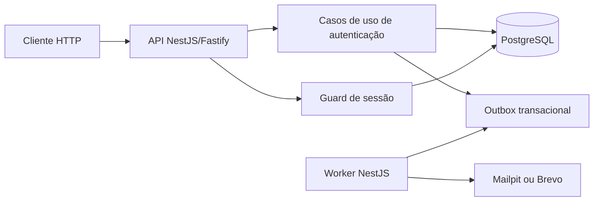

# Barber Calendar API

API de autenticação multi-tenant da Barber Calendar. O serviço permite cadastrar a primeira conta administradora de uma barbearia e autenticar membros exclusivamente por códigos OTP enviados por e-mail, sem senha.

O escopo atual inclui criação provisória de cadastro, confirmação atômica do tenant, sessões JWT restritas ao tenant, entrega assíncrona por outbox e limitação persistente de tentativas.

## Sumário

- [Funcionalidades](#funcionalidades)
- [Arquitetura](#arquitetura)
- [Stack tecnológica](#stack-tecnológica)
- [Requisitos](#requisitos)
- [Início rápido com Docker](#início-rápido-com-docker)
- [Configuração](#configuração)
- [Execução sem Docker](#execução-sem-docker)
- [API](#api)
- [Banco de dados](#banco-de-dados)
- [Testes e qualidade](#testes-e-qualidade)
- [Estrutura do projeto](#estrutura-do-projeto)
- [Documentação](#documentação)
- [Contribuição](#contribuição)

## Funcionalidades

- Cadastro provisório de tenant e primeiro administrador.
- Criação definitiva de tenant, conta e vínculo somente após OTP válido.
- Login sem senha por OTP enviado exclusivamente por e-mail.
- Respostas uniformes para identidades conhecidas, desconhecidas ou inelegíveis.
- OTP de seis dígitos, uso único, validade de 10 minutos e digest HMAC-SHA-256.
- Sessões simultâneas com duração configurável entre 15 minutos e 7 dias.
- JWT RS256 com escopo de tenant e revalidação da sessão no PostgreSQL.
- Outbox transacional com envelope AES-256-GCM, retry e expurgo do payload.
- Limitação persistente por identidade e IP, inclusive entre reemissões.
- Eventos de segurança e logs estruturados com redação de dados sensíveis.
- Adapters de e-mail para Mailpit e Brevo.

## Arquitetura

O projeto é um monólito modular NestJS. Cada capacidade separa domínio, aplicação e infraestrutura; regras de lint e testes arquiteturais impedem que domínio e casos de uso dependam de NestJS, Fastify ou `pg`.



A API e o worker usam a mesma imagem OCI, mas executam como processos separados. O PostgreSQL é a autoridade transacional para desafios OTP, sessões, outbox e limites de frequência.

## Stack tecnológica

| Categoria              | Tecnologia                               |
| ---------------------- | ---------------------------------------- |
| Runtime                | Node.js 24                               |
| Linguagem              | TypeScript 6, ESM e modo estrito         |
| API                    | NestJS 12 com Fastify 5                  |
| Banco de dados         | PostgreSQL 18.6 com SQL explícito e `pg` |
| Validação              | Zod 4 e OpenAPI 3.1                      |
| Tokens                 | JWT RS256 com `jose`                     |
| Testes                 | Vitest 5                                 |
| Qualidade              | ESLint 10 e Prettier 3                   |
| Containers             | Docker e Docker Compose                  |
| Gerenciador de pacotes | pnpm 12                                  |

## Requisitos

- Node.js `>=24 <25`.
- pnpm `>=12 <13` — o projeto fixa `pnpm@12.10.1`.
- Docker com Docker Compose para PostgreSQL, Mailpit e testes E2E.

## Início rápido com Docker

Instale as dependências conforme o lockfile:

```bash
corepack enable
corepack prepare pnpm@12.10.1 --activate
pnpm install --frozen-lockfile
```

Crie a configuração local:

```bash
cp .env.example .env
```

Substitua todos os valores `replace-with-*` por segredos locais. As chaves HMAC, a chave AES da outbox e o par RSA do JWT devem ser distintos. Em `JWT_PRIVATE_KEY` e `JWT_PUBLIC_KEY`, represente as quebras de linha do PEM com `\n` quando armazenar o valor em uma única linha.

Suba PostgreSQL, Mailpit, API e worker:

```bash
docker compose up --build --wait
```

Serviços locais:

| Serviço    | Endereço                       |
| ---------- | ------------------------------ |
| API        | `http://localhost:3000`        |
| Health     | `http://localhost:3000/health` |
| Readiness  | `http://localhost:3000/ready`  |
| Mailpit    | `http://localhost:8025`        |
| PostgreSQL | `localhost:5432`               |

Encerre os serviços preservando o volume do banco:

```bash
docker compose down
```

Para recriar o banco local do zero, remova também o volume. Este comando apaga os dados locais:

```bash
docker compose down -v
```

## Configuração

O processo valida as variáveis antes de aceitar tráfego. Consulte [.env.example](.env.example) para o conjunto completo.

| Variável                | Obrigatória | Descrição                                                               |
| ----------------------- | ----------: | ----------------------------------------------------------------------- |
| `DATABASE_URL`          |         Sim | URL PostgreSQL usada pela API e pelo worker.                            |
| `AUTH_SESSION_TTL`      |         Não | Duração ISO-8601 da nova sessão; padrão `PT24H`, entre `PT15M` e `P7D`. |
| `OTP_HMAC_KEY`          |         Sim | Pepper do digest dos códigos OTP, com pelo menos 32 caracteres.         |
| `THROTTLE_HMAC_KEY`     |         Sim | Chave distinta para anonimizar identidade e IP nos limites.             |
| `OUTBOX_ENCRYPTION_KEY` |         Sim | Chave AES de 32 bytes codificada em Base64.                             |
| `JWT_PRIVATE_KEY`       |         Sim | Chave privada RSA em PEM para emissão de tokens.                        |
| `JWT_PUBLIC_KEY`        |         Sim | Chave pública RSA em PEM para validação de tokens.                      |
| `JWT_KEY_ID`            |         Sim | Identificador `kid` da chave JWT.                                       |
| `JWT_ISSUER`            |         Sim | Emissor esperado nos tokens.                                            |
| `JWT_AUDIENCE`          |         Sim | Audiência esperada nos tokens.                                          |
| `EMAIL_PROVIDER`        |         Não | `mailpit` por padrão ou `brevo`.                                        |
| `BREVO_API_KEY`         |  Para Brevo | Credencial da API quando `EMAIL_PROVIDER=brevo`.                        |
| `PORT`                  |         Não | Porta HTTP; padrão `3000`.                                              |

Nunca versione o arquivo `.env`, chaves privadas ou credenciais reais.

## Execução sem Docker

O banco deve estar preparado antes da API. Exporte as variáveis de ambiente e, para uma aplicação executada no host, use uma `DATABASE_URL` que aponte para `localhost`.

Desenvolvimento com recarga automática:

```bash
pnpm start:dev
```

Build e execução da API:

```bash
pnpm build
pnpm start:prod
```

Execução do worker após o build:

```bash
pnpm worker
```

## API

O contrato versionado está em [OpenAPI 3.1](specs/001-tenant-authentication/contracts/openapi.yaml). O serviço não expõe Swagger UI ou ReDoc no runtime atual.

| Método | Rota                         | Finalidade                                             |
| ------ | ---------------------------- | ------------------------------------------------------ |
| `POST` | `/v1/tenants/register`       | Iniciar cadastro provisório do tenant.                 |
| `POST` | `/v1/auth/otp-requests`      | Solicitar OTP de login.                                |
| `POST` | `/v1/auth/otp-verifications` | Verificar OTP de cadastro ou login e criar uma sessão. |
| `GET`  | `/health`                    | Verificar o processo HTTP.                             |
| `GET`  | `/ready`                     | Verificar banco e revisão compatível do schema.        |

Erros HTTP seguem Problem Details e incluem um `correlation_id`. Respostas de autenticação não revelam se e-mail, conta, tenant ou vínculo existem.

## Banco de dados

O schema não é criado por ORM, migration runner ou startup da aplicação. A fonte canônica são os scripts em `database/schema/`, executados em ordem por `database/init/00-bootstrap.sql` quando o container PostgreSQL inicia com armazenamento vazio.

Alterações em bancos persistentes usam scripts manuais em:

```text
database/releases/<release>/up.sql
database/releases/<release>/verify.sql
database/releases/<release>/rollback.sql
```

O usuário `barber_runtime` possui somente os privilégios DML necessários. A revisão suportada fica em `app_meta.schema_build` e é conferida pelo endpoint `/ready`.

Valide o bootstrap, grants, constraints e índices:

```bash
docker compose -f compose.e2e.yaml up -d --wait db-e2e
docker compose -f compose.e2e.yaml exec -T db-e2e \
  psql -v ON_ERROR_STOP=1 -U postgres -d barber_calendar_e2e \
  -f /opt/app-sql/verify/assertions.sql
docker compose -f compose.e2e.yaml down -v --remove-orphans
```

## Testes e qualidade

| Comando                 | Verificação                                                 |
| ----------------------- | ----------------------------------------------------------- |
| `pnpm lint`             | ESLint, ciclos e fronteiras arquiteturais.                  |
| `pnpm typecheck`        | TypeScript estrito sem emissão.                             |
| `pnpm build`            | Build NestJS de produção.                                   |
| `pnpm test:unit`        | Testes unitários e arquiteturais.                           |
| `pnpm test:contract`    | Compatibilidade com o contrato OpenAPI.                     |
| `pnpm test:integration` | Integração com PostgreSQL indicado por `DATABASE_URL`.      |
| `pnpm test:e2e`         | Ambiente PostgreSQL/Mailpit descartável e suíte E2E serial. |
| `pnpm contract:check`   | Estrutura obrigatória do OpenAPI 3.1.                       |
| `pnpm schema:check`     | Bootstrap vazio e comparação do snapshot estrutural.        |
| `pnpm ci:check`         | Todos os gates executados pela CI e pelo pre-commit.        |

Os testes E2E usam `compose.e2e.yaml`, armazenamento `tmpfs` e teardown com remoção de volumes mesmo quando a suíte falha.

O Husky instala `.husky/pre-commit` durante `pnpm install`. Antes de cada commit, o hook executa `pnpm ci:check`, incluindo as suítes que dependem de Docker.

## Estrutura do projeto

```text
.
├── src/
│   ├── modules/
│   │   ├── authentication/
│   │   ├── notifications/
│   │   ├── outbox/
│   │   └── tenancy/
│   ├── shared/
│   ├── main.ts
│   └── worker.ts
├── database/
│   ├── init/
│   ├── schema/
│   ├── releases/
│   ├── seeds/
│   └── verify/
├── test/
│   ├── unit/
│   ├── integration/
│   ├── contract/
│   ├── e2e/
│   └── architecture/
├── specs/001-tenant-authentication/
├── docs/
├── compose.yaml
└── compose.e2e.yaml
```

## Documentação

- [Especificação funcional](specs/001-tenant-authentication/spec.md)
- [Plano de implementação](specs/001-tenant-authentication/plan.md)
- [Modelo de dados](specs/001-tenant-authentication/data-model.md)
- [Decisões técnicas](specs/001-tenant-authentication/research.md)
- [Guia de validação](specs/001-tenant-authentication/quickstart.md)
- [Contrato OpenAPI](specs/001-tenant-authentication/contracts/openapi.yaml)
- [Implantação](docs/deployment.md)

## Contribuição

Antes de enviar uma alteração, execute os testes proporcionais ao risco, lint e type checking. Mudanças estruturais no PostgreSQL devem seguir o checklist de [CONTRIBUTING.md](CONTRIBUTING.md), incluindo scripts explícitos de aplicação, verificação e rollback.
